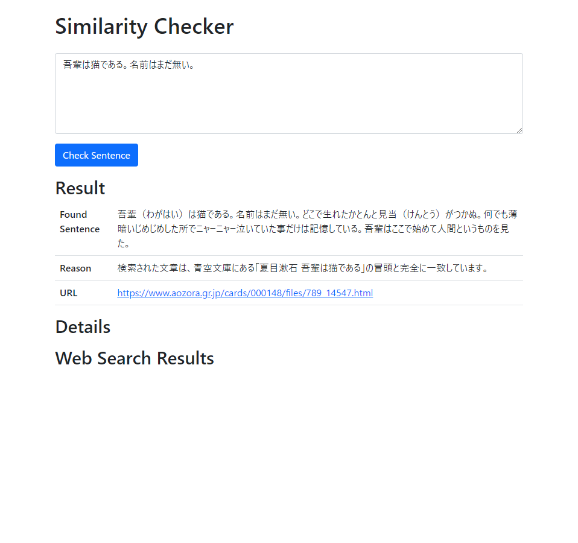
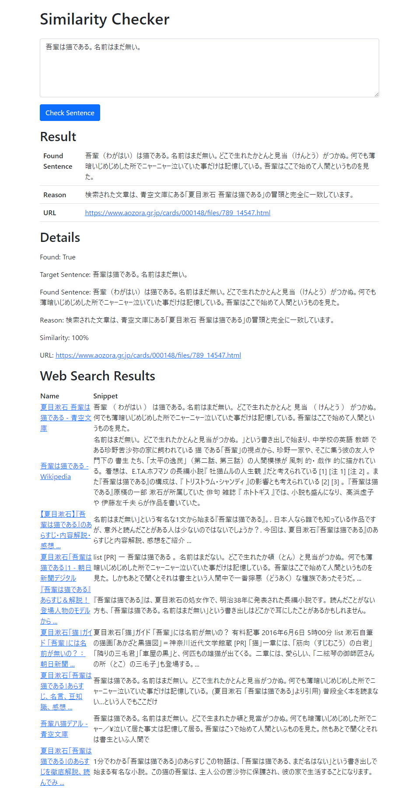

# Text Similarity

<p align="center">

</p>


<p align="center">
Search the Internet for similar texts. 
</p>

sample:


## Usage
### Setting
Make the necessary settings

Copy the `.env.example` file to `.env` and edit it to populate its variables.
```
cp .env.example .env
```
`.env` file:
```
OPENAI_API_KEY=<ChatGPT OpenAI API Key>
BING_SEARCH_V7_SUBSCRIPTION_KEY=<Bing Search Key>
BING_SEARCH_V7_ENDPOINT=https://api.bing.microsoft.com/
```

Alternatively, you can set environment variables directly
```
export OPENAI_API_KEY=<ChatGPT OpenAI API Key>
export BING_SEARCH_V7_SUBSCRIPTION_KEY=<Bing Search Key>
export BING_SEARCH_V7_ENDPOINT=https://api.bing.microsoft.com/
```

### Run Server
Run Server:
```
python manage.py runserver
```

or,  
docker run:
```
docker build -t similarity .
docker run -d -p 8000:8000 --env-file .env similarity
```

access to: [http://127.0.0.1:8000/](http://127.0.0.1:8000/)

## Character Limit
The maximum text you can enter is 1,500 characters. This is a Bing Search API limitation.

https://learn.microsoft.com/ja-jp/rest/api/cognitiveservices-bingsearch/bing-web-api-v7-reference#the-request-must-use-the-https-protocol

## Development
To develop, set up your environment as follows
```
ython -m venv .venv
source .venv/bin/activate
pip install -r requirements.txt 
```

## Application Smaple Image
