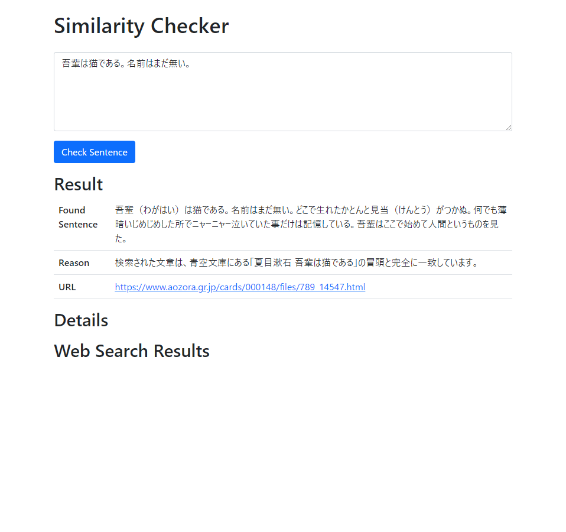
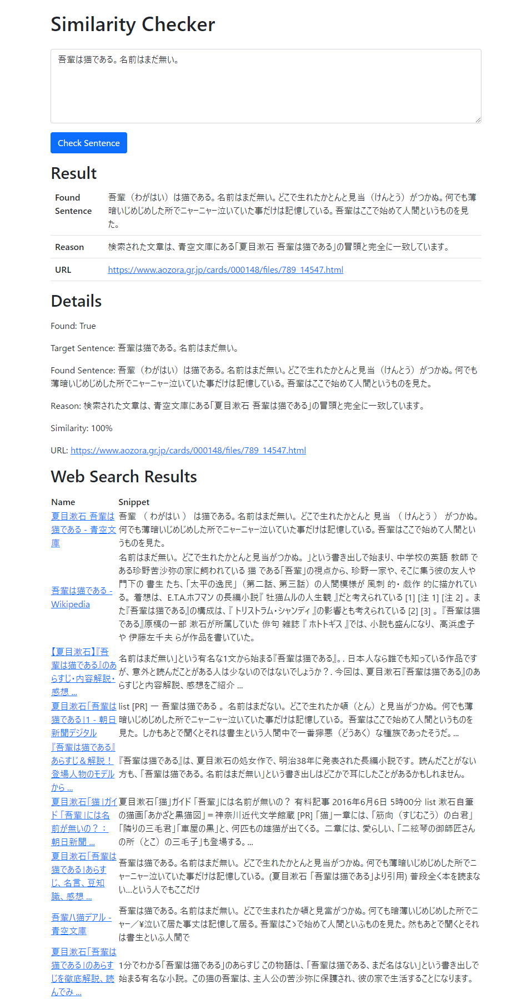

# Text Similarity

<p align="center">

</p>


<p align="center">
Search the Internet for similar texts. 
</p>

sample:


### Usage
Make the necessary settings
```
export OPENAI_API_KEY=<ChatGPT OpenAI API Key>
export BING_SEARCH_V7_SUBSCRIPTION_KEY=<Bing Search Key>
export BING_SEARCH_V7_ENDPOINT=https://api.bing.microsoft.com/
```

```
cd text_similartity
python manage.py runserver
```

access to: [http://127.0.0.1:8000/](http://127.0.0.1:8000/)

### Character Limit
The maximum text you can enter is 1,500 characters. This is a Bing Search API limitation.

https://learn.microsoft.com/ja-jp/rest/api/cognitiveservices-bingsearch/bing-web-api-v7-reference#the-request-must-use-the-https-protocol

### Development
```
ython -m venv .venv
source .venv/bin/activate
pip install -r requirements.txt 
```

### Application Smaple Image
